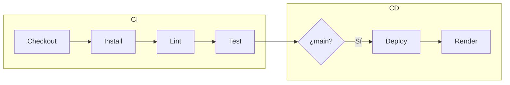

# Proyecto API REST 

API REST con Node.js y Express — caso de estudio para un flujo CI/CD completo (GitHub Actions + despliegue en Render).

## Caso de estudio

- **Stack:** Node.js, Express, Jest, ESLint.
- **Objetivo:** Integración continua (lint + tests en cada push/PR) y despliegue continuo (deploy automático a Render cuando se hace push a `main`).

## Endpoints

| Método | Ruta     | Descripción                          |
|--------|----------|--------------------------------------|
| GET    | `/`      | Información de la API y versión.     |
| GET    | `/health`| Health check (útil para el PaaS).    |
| GET    | `/sumar?a=<n>&b=<n>` | Suma de dos números (query params `a` y `b`). |

Ejemplo: `GET /sumar?a=2&b=3` → `{ "resultado": 5 }`.

## Ejecución en local

```bash
npm install
npm run lint
npm test
npm start
```

El servidor queda en `http://localhost:3000` (o en el puerto indicado por la variable de entorno `PORT`).

## CI/CD

El flujo está definido en [.github/workflows/ci.yml](.github/workflows/ci.yml).

- **CI (Integración continua):** en cada **push** y en cada **pull request** se ejecuta:
  1. Checkout del código
  2. Instalación de dependencias (`npm ci`)
  3. Lint (`npm run lint`)
  4. Tests (`npm test`)

- **CD (Despliegue continuo):** solo en **push a la rama `main`**, y solo si el job de CI termina correctamente:
  1. Se llama al **Render Deploy Hook** (si está configurado el secret `RENDER_DEPLOY_HOOK` en el repositorio).

Para activar el despliegue automático:

1. Crea un Web Service en [Render](https://render.com) conectado a este repo.
2. En el servicio, obtén la URL del **Deploy Hook**.
3. En GitHub: **Settings → Secrets and variables → Actions** → crea el secret `RENDER_DEPLOY_HOOK` con esa URL.

Configuración sugerida en Render:

- **Build command:** `npm install` o `npm ci`
- **Start command:** `node src/server.js`
- **Environment:** la variable `PORT` la asigna Render automáticamente.

## Diagrama del flujo



## Alternativa: Jenkins

Incluye un [Jenkinsfile](Jenkinsfile) que replica el mismo flujo (checkout, `npm ci`, lint, tests y opcionalmente el deploy vía deploy hook). Configura en Jenkins la credencial con el ID `render-deploy-hook` que contenga la URL del deploy hook.
